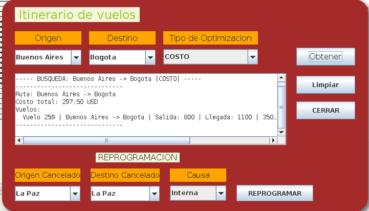

<div align="center">

# ✈️ Simulador de Vuelos
### Itinerario de Vuelos — Teoría de Grafos & Dijkstra


Proyecto académico en **Java** desarrollado en **BlueJ** que simula la planificación de itinerarios de vuelos aplicando **teoría de grafos** y el **algoritmo de Dijkstra**.

Encuentra la **ruta óptima** entre aeropuertos según tres criterios: **costo**, **tiempo** o **número de escalas**, considerando promociones, disponibilidad de asientos y reprogramación de vuelos cancelados.

</div>

---

## 📸 Captura



---

## 🚀 Funcionalidades

- 🗺️ **Búsqueda de ruta óptima** con el algoritmo de Dijkstra sobre un grafo de aeropuertos.
- ⚖️ **Tres criterios de optimización**: COSTO, TIEMPO y ESCALA.
- 🔄 **Reprogramación de vuelos cancelados** según causa interna o externa (con penalización).
- 🎟️ **Promociones**: descuentos por tiempo (10 %) y por distancia (15 %).
- 💺 **Control de asientos**: los vuelos sin disponibilidad se descartan de la búsqueda.
- 🖥️ **Interfaz gráfica Swing** con autocompletado de aeropuertos.
- 📁 **Carga de datos desde archivos** (`aeropuertos.txt`, `vuelos.txt`) y escritura de resultados en `salida.txt`.
- ✅ **Pruebas unitarias** para todas las clases principales.

---

## 📁 Estructura del proyecto

| Clase | Descripción |
|---|---|
| `Main` | Punto de entrada: carga los datos y abre la interfaz |
| `Interfaz` | Ventana Swing con búsqueda de rutas y reprogramación |
| `GrafoViajes` | Grafo de aeropuertos + algoritmo de Dijkstra |
| `NodoAeropuerto` | Nodo del grafo (aeropuerto con sus vuelos de salida) |
| `Viaje` | Vuelo: aerolínea, horarios, capacidad, costo y promociones |
| `LectorArchivos` | Carga aeropuertos y vuelos desde archivos |
| `EscritorArchivos` | Escribe los itinerarios en `salida.txt` |
| `ReprogramadorVuelos` | Bloquea vuelos cancelados y recalcula rutas alternativas |
| `TipoOptimizacion` | Interfaz estrategia: `OptimizarCosto`, `OptimizarTiempo`, `OptimizarEscala` |
| `IteradorAeropuertos` | Iterador sobre los nodos del grafo |
| `TipoViaje`, `TipoDestino`, `TipoPromocion`, `TipoPenalizacion` | Enumerados del dominio |

---

## 📂 Formato de los archivos de datos

### `aeropuertos.txt`

```
Ciudad,Pais
La Paz,Bolivia
Santa Cruz,Bolivia
...
```

### `vuelos.txt`

```
aerolinea,codigo,origen,destino,tipoViaje,tipoDestino,horaSalida,horaLlegada,capacidad,costo,promocion,penalizacion
BoA,101,La Paz,Santa Cruz,Directo,Nacional,600,730,150,89.00,PorTiempo,Ninguna
...
```

### `entrada.txt` (registro de operaciones)

Cada búsqueda o reprogramación realizada desde la interfaz se guarda en este archivo con el formato:

```
BUSQUEDA,<origen>,<destino>,<COSTO|TIEMPO|ESCALA>
REPROGRAMAR,<origen>,<destino>,<Interna|Externa>
```

---

## ▶️ Cómo ejecutar

> 📂 Todo el código fuente se encuentra en la carpeta **`presentarEsteProyectoAgrafos/`** (contiene `package.bluej`, así que se abre directamente como proyecto de BlueJ).

1. Abrir la carpeta `presentarEsteProyectoAgrafos/` en **BlueJ** (o en cualquier IDE compatible con Java).
2. Ejecutar la clase `Main`.
3. Seleccionar origen, destino y criterio de optimización en la interfaz.
4. El itinerario resultante se muestra en pantalla y se guarda en `salida.txt`.

---

## 🧪 Pruebas

Cada clase principal tiene su prueba asociada (`*Test.java`) ejecutable desde BlueJ.

---

## 🛠️ Tecnologías

- ☕ **Java 8+**
- 📘 **BlueJ** (entorno de desarrollo educativo)
- 🖥️ **Swing** (interfaz gráfica)
- 🕸️ **Teoría de grafos** / algoritmo de **Dijkstra**
- 🧩 **Patrón Strategy** para los criterios de optimización

---

<div align="center">

**Proyecto académico** — Estructuras de Datos / Teoría de Grafos

</div>
